# End Recoverd

> **4 new End biomes · 8 new structures to explore · vanilla End Cities restored**
> A small End update for **Minecraft 26.3** that runs on top of **Endercon 4.0**. No mods needed.

## IMPORTANT

- **ENDERCON 4.0 IS REQUIRED.** This data pack does not work on its own.
- Download Endercon [here](https://modrinth.com/datapack/endercon).
- Enable **Endercon first**, then End Recoverd, and put End Recoverd **above** Endercon in the list of selected data packs.
- Use it in a **new world** (or in End chunks that have not been generated yet). See [Installation](#installation).

-----------------------

## What is in this data pack?

- **4 new biomes** in the End, each with its own ground, plants, atmosphere, music and particles
- A total of **8 new structures** to explore (**2 per biome**)
- Every structure contains a chest (see the [loot table overview](#structures-and-loot))
- **Vanilla End Cities are back.** Endercon empties the End City structure set (it is meant for a mod), so End Recoverd restores it and allows cities in the new biomes
- Works together with Endercon's terrain: **crazy generation** and new places to find
- 4 of the 8 structures are **hand-built** by the author

> The new biomes are not a replacement for Endercon. They appear in patches (roughly a third of the land on the surface layer) and Endercon's own biomes stay where they were.

-----------------------

## Showcase!!!

Here are all biomes displayed (with the Endercon data pack):


-----------------------

## Moss Thicket


The Moss Thicket is an overgrown, mossy place with **giant mushrooms** (wide ones with a moss cap and tall ones with a flowering-azalea cap), moss carpets, azaleas, glowing lichen on the cliffs and purpur lamp posts topped with end rods.
Warped spores and spore blossom particles drift through the air, with the music and ambience of the lush caves and warped forest.

The ground is a mix of:
<br>
<br>


<br clear="all"/>

Moss Block, Mossy Cobblestone, Rooted Dirt, Mud, Podzol and patches of End Stone. The underside of the islands is rooted dirt and moss.

### Structures

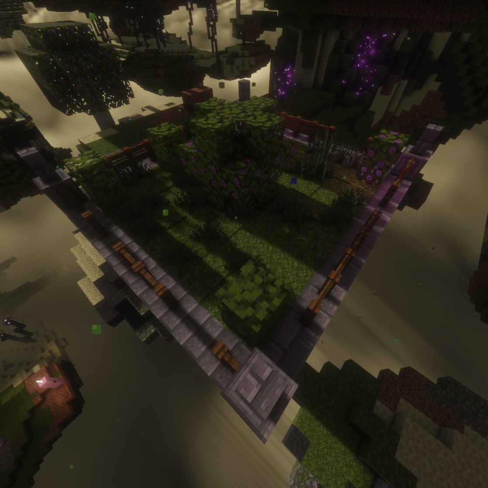
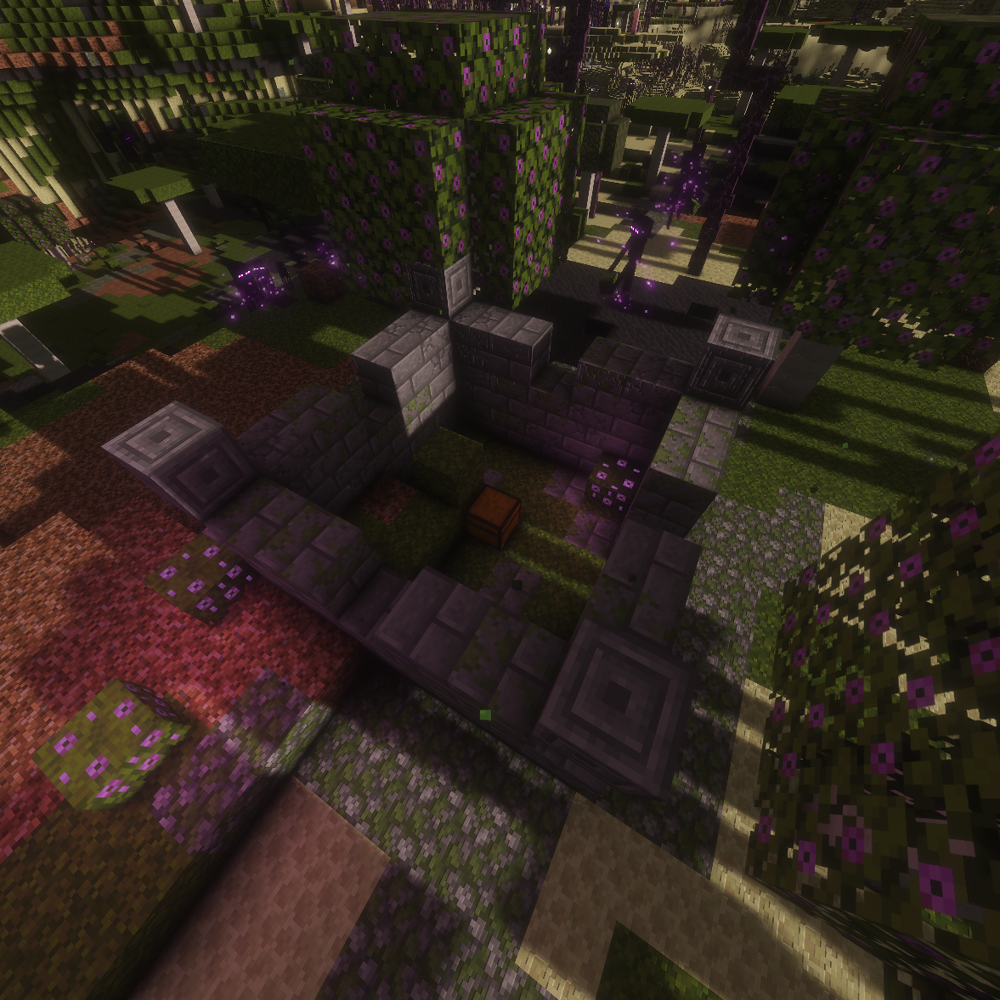

**Moss Garden** (hand-built) & **Overgrown Ruin**
Each of these structures spawns with a loot chest.
<br clear="all"/>

-----------------------

## Amethyst Reaches

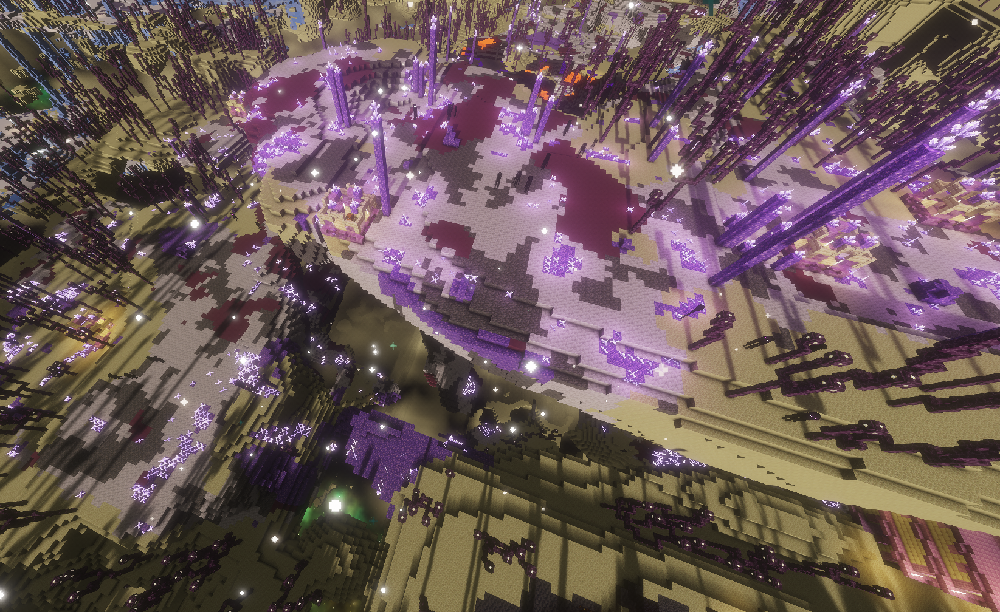

The Amethyst Reaches are a crystal landscape with a purple glow. Clusters of **crystal spires** rise out of the ground, with the occasional **great crystal** that towers 10 to 20 blocks high, amethyst boulders and fields of amethyst buds. The air glitters with end rod particles and the music is that of the dripstone caves.

The ground is a mix of:
<br>
<br>


<br clear="all"/>

Calcite, Amethyst Block, Tuff, Purple Terracotta and patches of End Stone, with a few Budding Amethyst blocks here and there.

### Structures

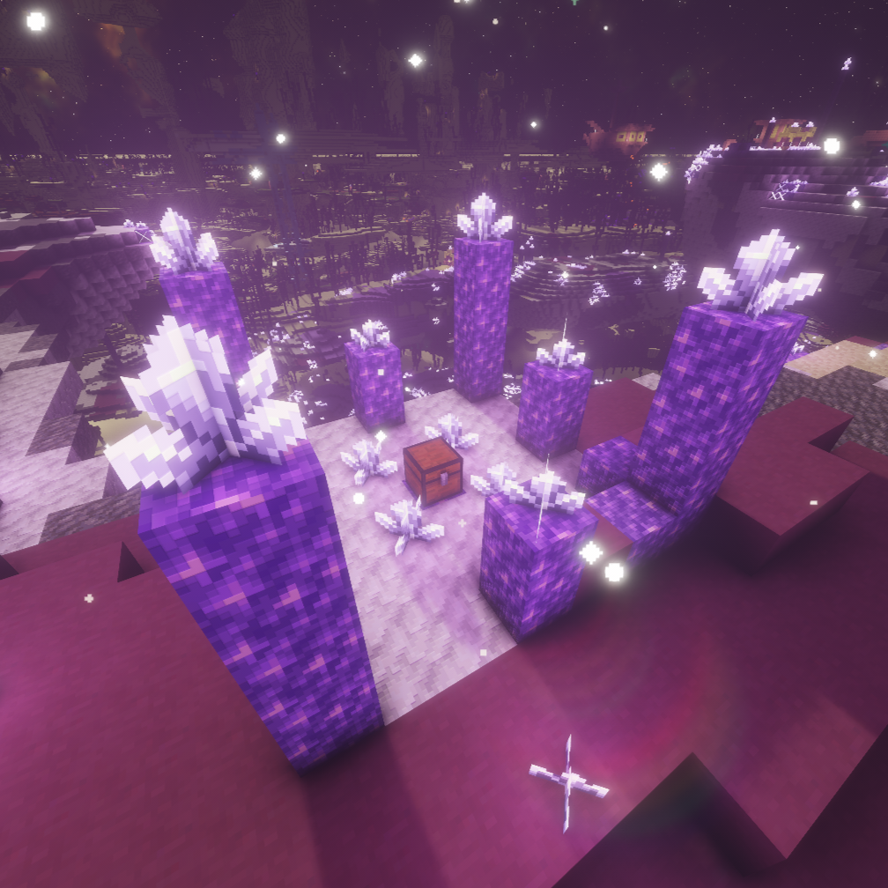
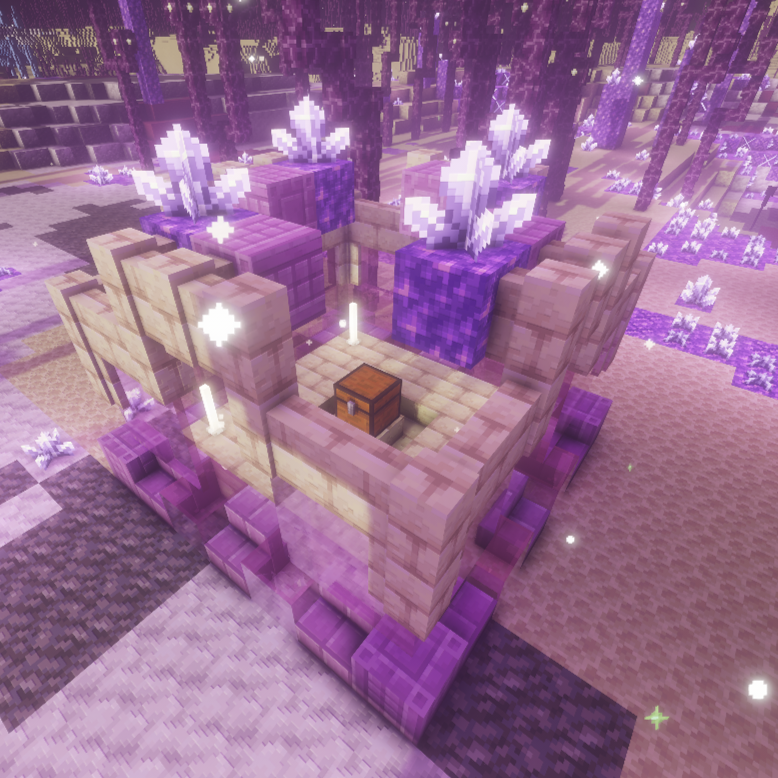

**Crystal Shrine** & **Crystal Ruin** (hand-built)
<br clear="all"/>

-----------------------

## Obsidian Crags

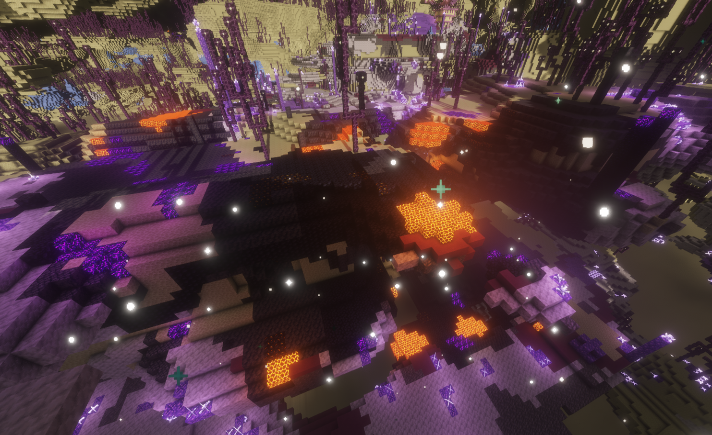

A dark, volcanic place. **Obsidian spires** with crying obsidian tips, basalt pillars and blackstone boulders stand on a ground of blackstone and basalt. Ash and crimson spores fall through the air, with the music and ambience of the basalt deltas.

> **Careful:** the ground contains **magma blocks**. Sneak or watch your step.

The ground is a mix of:

Blackstone, Smooth Basalt, Basalt, Obsidian, Magma Block, Crying Obsidian, a little Gilded Blackstone and patches of End Stone. The underside of the islands is blackstone and basalt.
<!-- add block icons here, like in the other biomes -->
<br clear="all"/>

### Structures

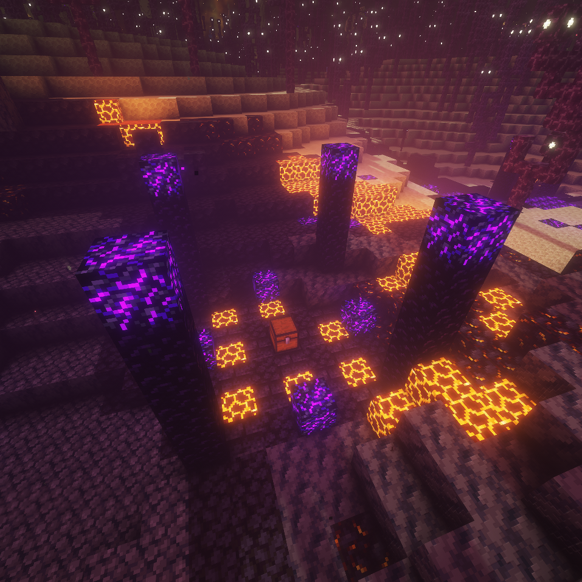
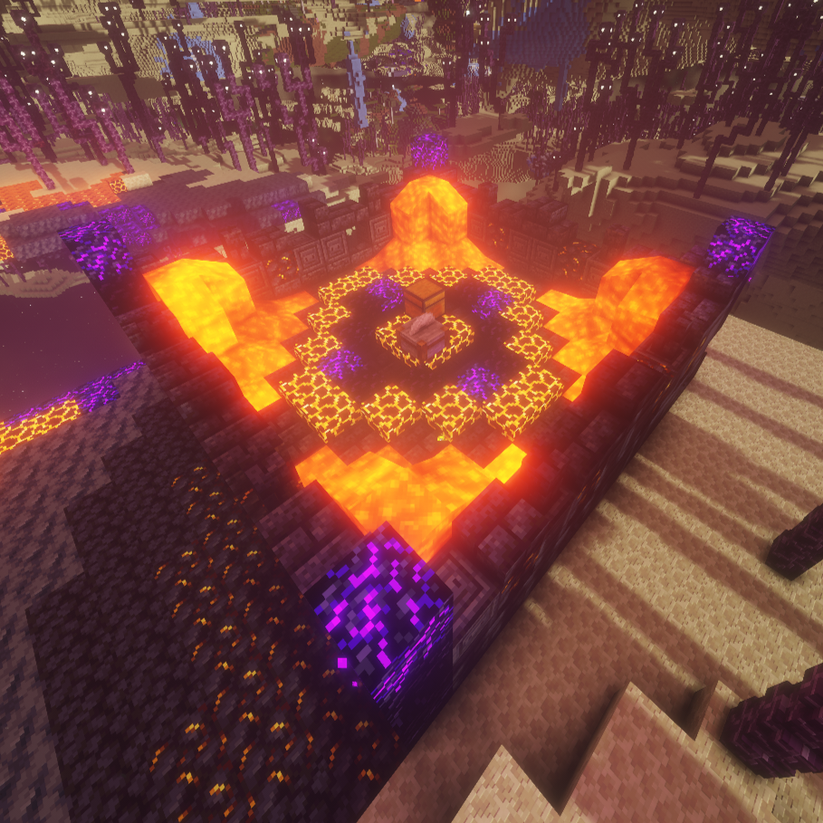

**Obsidian Altar** & **Obsidian Ruin** (hand-built)
The altar sits in a ring of magma blocks.
<br clear="all"/>

-----------------------

## Glacial Veil

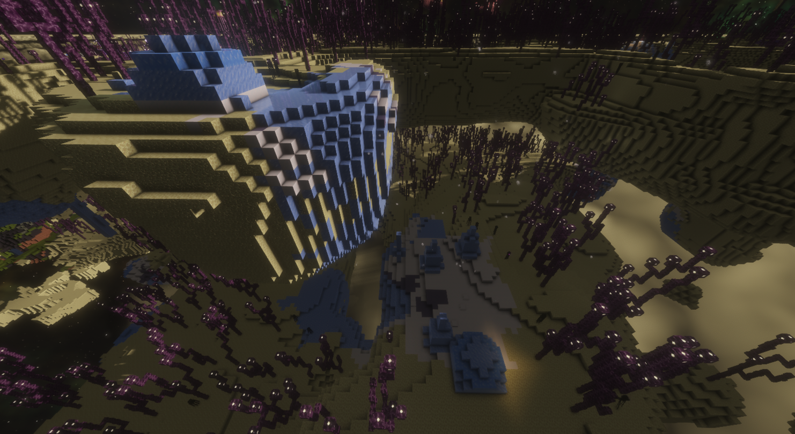

A frozen landscape of snow and ice. **Ice spikes** rise out of the snow, **ice lanterns** (packed ice pillars topped with sea lanterns) light the way, and frost boulders and snow cover cover the ground. Snowflakes fall through the air and the music is that of the frozen peaks.

The ground is a mix of:

Snow Block, Packed Ice, Blue Ice, Light Blue Terracotta and patches of End Stone. The underside of the islands is packed ice and blue ice.
<!-- add block icons here, like in the other biomes -->
<br clear="all"/>

### Structures

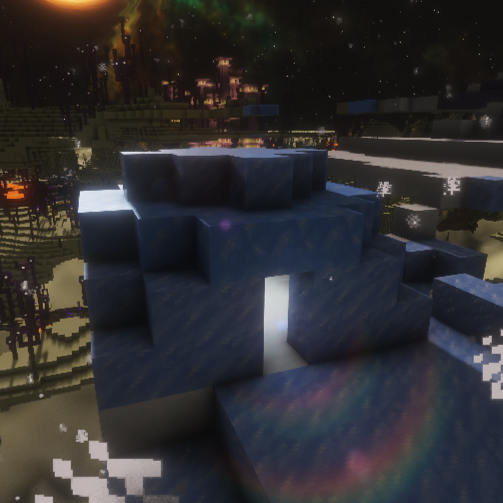
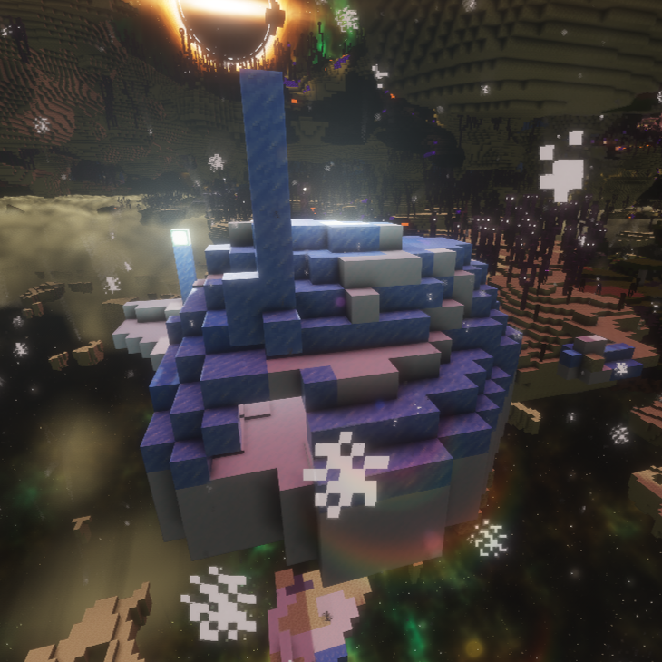

**Frozen Cache** & **Ice Igloo** (hand-built)
<br clear="all"/>

-----------------------

## Structures and loot

All structures are placed on the surface of the island with a small foundation. They are placed as *features*, so they are rare, spread out, and (except where noted) rotate randomly.

| Biome | Structure | Hand-built | Chest loot | Rarity* |
|---|---|:---:|---|---|
| Moss Thicket | Overgrown Ruin | | Custom table `overgrown_ruin` | 1 in 24 chunks |
| Moss Thicket | Moss Garden | ✓ | Vanilla End City treasure | 1 in 29 chunks |
| Amethyst Reaches | Crystal Shrine | | Custom table `crystal_shrine` | 1 in 24 chunks |
| Amethyst Reaches | Crystal Ruin | ✓ | *Chest is currently empty* (custom table `crystal_ruin` exists but is not linked yet) | 1 in 29 chunks, never rotates |
| Obsidian Crags | Obsidian Altar | | Custom table `obsidian_altar` | 1 in 24 chunks |
| Obsidian Crags | Obsidian Ruin | ✓ | Vanilla End City treasure | 1 in 35 chunks |
| Glacial Veil | Frozen Cache | | Vanilla igloo loot | 1 in 24 chunks |
| Glacial Veil | Ice Igloo | ✓ | Vanilla End City treasure | 1 in 29 chunks |

\* A chance per chunk *inside that biome*, so on average one structure per 24 to 35 chunks of that biome.

### Custom loot (what you can find)

- **Crystal Shrine:** amethyst shards and clusters, ender pearls, end rods, chorus fruit, lapis, XP bottles, diamonds, a spyglass, enchanted books. *Rare:* shulker shells, an echo shard, an enchanted diamond pickaxe.
- **Overgrown Ruin:** moss, glow berries, azaleas, bone meal, spore blossoms, seeds, a name tag, a lead, a saddle, iron, emeralds, enchanted books. *Rare:* a golden apple, diamonds, a brush.
- **Obsidian Altar:** obsidian, crying obsidian, blaze rods, magma cream, gold, quartz, fire charges, ender pearls, an enchanted diamond sword, enchanted books. *Rare:* netherite scrap, a totem of undying, ancient debris.

All loot tables live in `data/endrecoverd/loot_table/` and can be tweaked: change `weight` (chance) and `min`/`max` (amounts) or add your own items.

-----------------------

## Installation

1. Download **[Endercon 4.0](https://modrinth.com/datapack/endercon)** and **End Recoverd**.
2. Put both `.zip` files in the `datapacks` folder of your world, or add them in the data pack screen when you create a world (**More → Data Packs**).
3. Enable **Endercon first** and confirm.
4. Enable **End Recoverd** and make sure it is **above** Endercon in the *Selected* list. If you enable End Recoverd first, Minecraft shows *"Data pack validation failed!"*.
5. Create a **new world**. Only End chunks that have not been generated yet get the new biomes.

### Requirements

| | |
|---|---|
| Minecraft | **26.3** (pack format 121) |
| Required data pack | **Endercon 4.0** |
| Mods | **None** |

### Finding the biomes and structures

Run these from anywhere (they search in the End):

```
/execute in minecraft:the_end run locate biome endrecoverd:moss_thicket
/execute in minecraft:the_end run locate biome endrecoverd:amethyst_reaches
/execute in minecraft:the_end run locate biome endrecoverd:obsidian_crags
/execute in minecraft:the_end run locate biome endrecoverd:glacial_veil
```

Press **F3** to see the biome name you are standing in. The biomes mainly appear on the large islands between about **300 and 800 blocks** from the center of the End.

The structures are placed as features, so `/locate structure` cannot find them. Fly through the matching biome instead, or look at one with the placement command:

```
/place template endrecoverd:crystal_shrine ~ ~ ~
```

Template names: `crystal_shrine`, `crystal_ruin`, `overgrown_ruin`, `moss_garden`, `obsidian_altar`, `obsidian_ruin`, `frozen_cache`, `ice_igloo`.

-----------------------

## Troubleshooting

| Problem | Cause / fix |
|---|---|
| *"Data pack validation failed!"* | Endercon is not enabled, or End Recoverd was enabled before Endercon. Enable Endercon first, then End Recoverd. Check the version of both packs, and open `logs/latest.log` for the exact error. |
| I do not see the new biomes | You are probably in an existing world, or in chunks that were already generated. Use a new world and fly to unexplored land. |
| `locate` says it cannot find the biome | Run it as `/execute in minecraft:the_end run locate biome ...`, and make sure the data pack is above Endercon. |
| The biomes are everywhere / too rare | The patch size and amount depend on Endercon's terrain and noise. Ask the author for a different threshold. |
| Warnings about `endercon:...` in VS Code / Spyglass | Not a bug: Spyglass only sees the folder you opened. Open a folder that contains both Endercon and End Recoverd. |

-----------------------

## Customizing

- **Structure rarity:** edit the `rarity_filter` `chance` in `data/endrecoverd/worldgen/placed_feature/<structure>.json` (higher = rarer).
- **Rotation:** in `worldgen/feature/<structure>.json`, add or remove `rotations` in the template data (`none`, `clockwise_90`, `180`, `counterclockwise_90`). Leave the field out for all four.
- **Loot:** change the files in `data/endrecoverd/loot_table/`.
- **Your own structures:** save one with a Structure Block as `endrecoverd:<name>`, copy the `.nbt` from `generated/endrecoverd/structure/` to `data/endrecoverd/structure/`, then add a `feature`, a `placed_feature` and add it to a biome in the `surface_structures` step (after `minecraft:end_gateway_return`).

-----------------------

## Credits

- **Created by:** Simon
- **Required data pack:** [Endercon](https://modrinth.com/datapack/endercon) by Walls
- Block icons are from the [Minecraft Wiki](https://minecraft.wiki)


## License & Credits

End Recoverd is licensed under [CC BY-NC-SA 4.0](https://creativecommons.org/licenses/by-nc-sa/4.0/).

Requires and builds on [Endercon](https://modrinth.com/datapack/endercon) by Walls
(CC BY-NC-SA 4.0). Endercon itself is **not** included in this repository.

Changes made to Endercon 4.0 files:
- `data/minecraft/dimension/the_end.json`: the cells of the vanilla End biomes are split
  into five cells to add the four End Recoverd biomes.
- `data/minecraft/worldgen/noise_settings/end.json`: temperature and vegetation noise scale
  changed (0.05 / 0.1 → 0.7) and `material_rule` set to `endrecoverd:end`.

NOT AN OFFICIAL MINECRAFT SERVICE. NOT APPROVED BY OR ASSOCIATED WITH MOJANG OR MICROSOFT.
