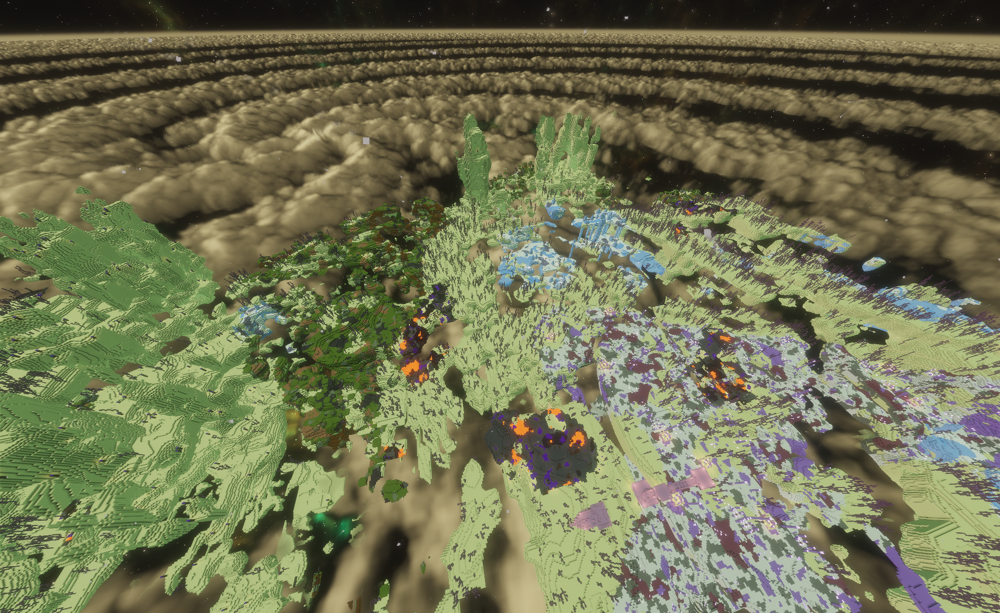
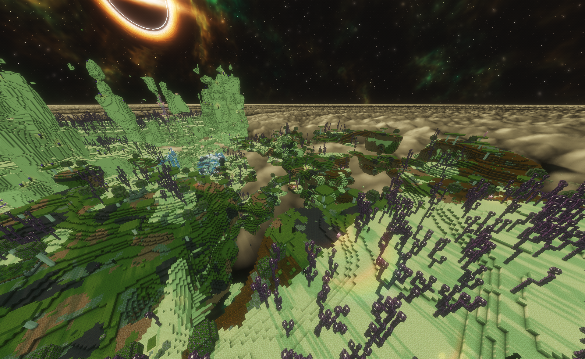

# End Recoverd Features:
------------------------
## IMPORTANT:
- **ENDERCON 4.0 IS REQUIRED**
- Download [here](https://modrinth.com/datapack/endercon)
-----------------------
## What is in this Data pack?
- 4 New biomes in the end
- Total of 8 new structures to explore (2 per biome)

> 4 Of the structures are zelfmade!

-> Each structure has loot!
- Combined with Endercon you have Crazy generation!
----------------------
## Showcase!!!
Here are all biomes displayed (With the Endercon data pack)

### Moss Thicket

The moss Thicket is a mossy place spawning with moss mushrooms with a ground of:
 
 

